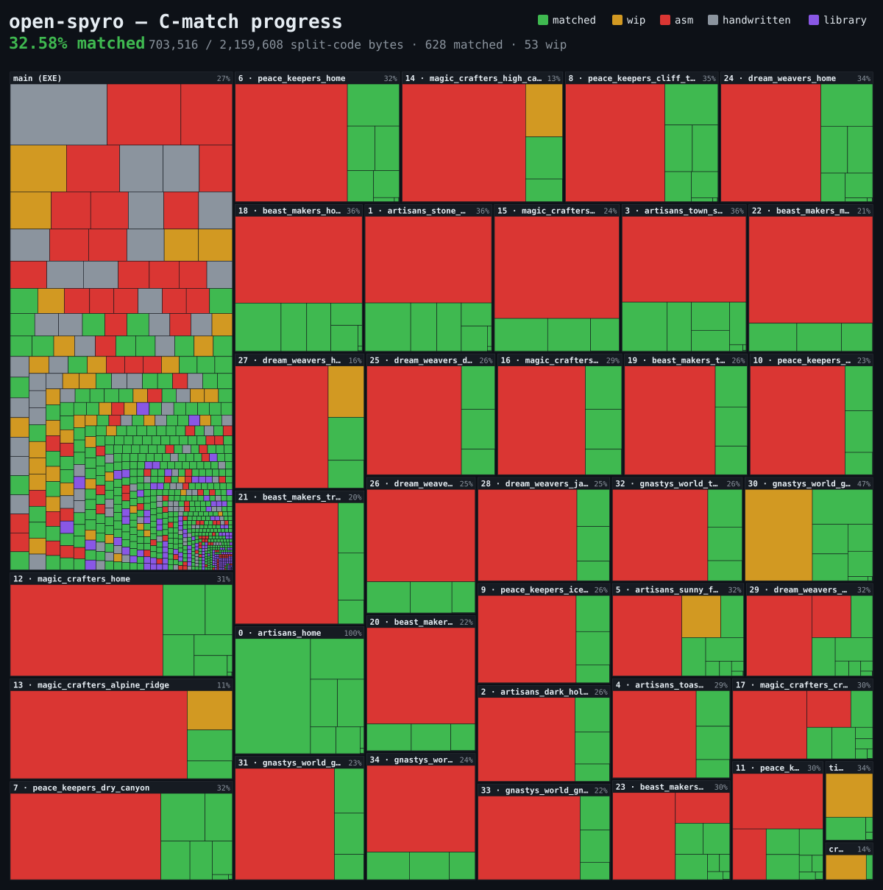

# open-spyro

<!-- progress-badge -->

<!-- /progress-badge -->

`open-spyro` is a **byte-for-byte matching decompilation** of
[**Spyro the Dragon**](https://en.wikipedia.org/wiki/Spyro_the_Dragon) _(PS1,
NTSC, `SCUS_942.28`)_. The goal is to rebuild the game's executable, all 37
overlays, and `WAD.WAD` from source that is provably identical to the original
disc, and to keep the project runnable in an emulator at every step.

> [!NOTE]
>
> **Phase 1 of 2: don't expect pretty code yet.** Right now the code is written
> to rebuild the game exactly, byte for byte, not to look nice. Once that hits
> ~100%, phase 2 cleans it up into readable code without breaking the exact
> rebuild.

_C-match progress (regenerated by `make progress`): see
[`PROGRESS.md`](PROGRESS.md)._

[](docs/progress_map.svg)

<sup>Each tile is one function, sized by its code bytes and grouped by layer
_(main EXE + 37 overlays)_</sup>

## Core invariant

Every commit builds a **byte-identical** `SCUS_942.28`, all 37 overlays, and a
byte-identical `WAD.WAD`, and is always runnable in an emulator. Functions not
yet matched-in-C link in as the **original assembly** _(`INCLUDE_ASM`)_.
**"Progress" = the fraction of code bytes expressed as verified-matching C.**

Target: `SCUS_942.28`, SHA-1 `84e3728ab94720d0873e2514adf4aade4935e0c5`, loads
at `0x80010000` _(file offset `0x800`)_. Main-EXE `.text` spans
`0x80012204`–`0x8006bb40`, 828 functions _(673 game code, 155 stock
PSY-Q/libc)_. 613 of these plus 982 globals were named in the old Ghidra project
_(reused here as a name/type dump only)_.

## Matching toolchain

- **Compiler:** gcc 2.7.2, built from source in the Docker image
  _(`/opt/gcc2.7.2/cc1`)_
- **Flags:**
  `-O2 -G8 -g3 -fverbose-asm -mips1 -mcpu=3000 -fgnu-linker -mno-abicalls -mgpopt -msoft-float`
  _(overlays override to `-G0`)_
- **Assembler:** `maspsx --aspsx-version 2.56 -G4 --expand-div` → GNU `as`/`ld`
- **Disasm/config:** splat / spimdisasm _(tools/open-spyro `split` group;
  `make split` runs them via `uv run`)_
- **asm→C:** m2c first pass → asm-differ / decomp-permuter / decomp.me to close
  the match. These three are owned by the `tools/open-spyro` uv project's
  `match` group; invoke them via
  `uv run --project tools/open-spyro -- m2c|asm-differ ...`

## Getting started

### Prerequisites

- **Docker** - hosts the locked matching toolchain _(gcc 2.7.2 + binutils +
  maspsx)_. `make setup` builds the image; every compile/link/diff runs inside
  it.
- **[uv](https://docs.astral.sh/uv/)** - runs the host Python tooling. All the
  `open-spyro` subcommands _(`split`, `progress`, `diff`, …)_ are invoked
  through `uv run`; no manual venv is needed.
- **For `make iso` / `make play`:** the host-native disc tools _(`mkpsxiso` +
  `dumpsxiso`, built by `make setup-iso`)_ and
  **[DuckStation](https://www.duckstation.org/)**. On macOS `make play` expects
  it at `/Applications/DuckStation.app` _(see `tools/play.sh`)_.

### Supplying the disc

You must supply your own original disc, copyrighted game data is never
committed. Drop your disc image into **`iso/`**: both the **`.cue`** and its
**`.bin`** are required _(the `.cue` is a text index that points at the `.bin`,
so the `.bin` must sit alongside it)_. A lone single-track `.bin` also works.
`make extract` auto-detects the image there, dumps the files into `disc/orig/`
_(gitignored)_, and asserts the `SCUS_942.28` SHA-1.

The `.cue`/`.bin` hashes themselves vary by dumper and track layout, so they're
not a useful check. What `make extract` _(and `make verify`)_ pin instead are
the SHA-1s of the files _inside_ the disc, the two primary matched artifacts,
for reference:

| File          | SHA-1                                      |
| ------------- | ------------------------------------------ |
| `SCUS_942.28` | `84e3728ab94720d0873e2514adf4aade4935e0c5` |
| `WAD.WAD`     | `ab68001377ea93fb309a5c2a35e772c9d1f57e0b` |

_(The full baseline set, overlays, `.STR` streams, etc., lives in
`config/sha1sums.txt`.)_

### Build & run

```sh
make setup      # build the matching toolchain (gcc 2.7.2 from source + binutils + maspsx + splat in Docker)
make setup-iso  # build the host-native disc tools (mkpsxiso + dumpsxiso) - needed for iso/play
make extract    # dump the original files from your disc image in iso/ (-> disc/orig/, gitignored)
make split      # disassemble into asm/ + config/
make build      # compile + link into a byte-identical SCUS_942.28 + overlays
make verify     # check rebuilt artifacts against the original SHA-1s
make iso        # repack into a runnable .bin/.cue (-> build/SpyrotheDragon.{bin,cue})
make play       # boot the rebuilt iso in DuckStation
make progress   # regenerate the C-match progress report
```

Run `make` with no target to print the target list.

### Comparing a C file against the original _(the match loop)_

To check whether a candidate C match rebuilds to the original bytes, use the
per-function byte-diff, the inner iteration of matching work:

```sh
uv run --project tools/open-spyro -- open-spyro diff <FunctionName>
# e.g. open-spyro diff ComputeInventoryProgressPercent
```

It rebuilds the containing artifact _(the main EXE, or the function's overlay)_,
slices the function's bytes at its VMA out of both the rebuilt file and
`disc/orig`, and prints an instruction-level side-by-side plus a match %. Exit
codes: `0` = byte-identical _(`MATCH`)_, `1` = differs, `2` = cannot run. Useful
flags: `--no-build` reuses the current build output as-is; `--full` prints every
instruction rather than just the diff hunks.

To supply a candidate match, add `src/c/<Name>.c` _(main EXE)_ or
`src/overlays/<segment>/<Name>.c` _(overlay)_, then re-run `diff`. The heavier
asm→C loop behind this, m2c first pass → asm-differ / decomp-permuter /
decomp.me, is described under [Matching toolchain](#matching-toolchain).

### Building the ISO

`make iso` writes the runnable disc to the gitignored **`build/`** dir.

- `build/SpyrotheDragon.bin` + `build/SpyrotheDragon.cue` - the repacked disc
- `build/main/SCUS_942.28` - the rebuilt executable staged into it

`make play` boots `build/SpyrotheDragon.cue` in
[DuckStation](https://duckstation.org/).

## Layout

| Path       | Contents                                                                                                                  |
| ---------- | ------------------------------------------------------------------------------------------------------------------------- |
| `config/`  | splat yaml, `symbol_addrs.txt`, `*.ld` fragments                                                                          |
| `src/`     | hand-written / matched C                                                                                                  |
| `asm/`     | nonmatching `.s` _(`INCLUDE_ASM` targets)_ + extracted data `.s`                                                          |
| `include/` | `types.h`, `funcs.h`, `globals.h` _(seeded by the one-time Ghidra import)_                                                |
| `assets/`  | passthrough binaries _(WAD, STR, Crash demo, license)_                                                                    |
| `tools/`   | `open-spyro` CLI _(uv package: progress, wad, splat-gen helpers)_, `Dockerfile` _(builds gcc 2.7.2 from source)_ + maspsx |
| `iso/`     | your source disc image goes here _(`.cue`/`.bin`, gitignored)_                                                            |
| `disc/`    | `orig/` - files extracted from your disc _(gitignored)_                                                                   |
| `build/`   | build output, incl. rebuilt `SCUS_942.28` + `SpyrotheDragon.{bin,cue}` _(gitignored)_                                     |

## Contributing

The steady-state work is _matching_: turning one `INCLUDE_ASM` function at a
time into C that compiles back to the **identical bytes**. A typical loop:

1. **Pick an unmatched function.** [`PROGRESS.md`](PROGRESS.md) lists what's
   still linked in as assembly.
2. **Draft the C.** Generate the m2c context file once, then run m2c for a
   first-pass decompile of the function out of its asm:

   ```sh
   make ctx   # (re)generate build/ctx.c - the m2c --context file (types + globals + funcs)

   # main EXE (asm/text.s):
   uv run --project tools/open-spyro -- \
     m2c --context build/ctx.c asm/text.s -f <FunctionName> > src/c/<FunctionName>.c

   # OR overlay (asm/overlays/<segment>/text.s):
   uv run --project tools/open-spyro -- \
     m2c --context build/ctx.c asm/overlays/<segment>/text.s -f <FunctionName> \
     > src/overlays/<segment>/<FunctionName>.c
   ```

   That first pass rarely matches, iterate against the original with asm-differ
   / [decomp.me](https://decomp.me/) (see
   [Matching toolchain](#matching-toolchain)). Expect to hand-adjust what m2c
   emits: it defaults to generic stand-in types _(`s32`/`u32`/`void *`, raw
   `*(s32 *)(x + 0xNN)` field pokes, invented locals)_ that you'll need to
   replace with the real types, struct fields, and signatures from `include/`,
   the codegen _(and therefore the match)_ often turns on getting those
   declarations right.

3. **Drop it in and check.** Add `src/c/<Name>.c` _(main EXE)_ or
   `src/overlays/<segment>/<Name>.c` _(overlay)_, then run
   `open-spyro diff <Name>` until it prints `MATCH` _(see
   [Comparing a C file against the original](#comparing-a-c-file-against-the-original-the-match-loop))_.
   Adding the `.c` is the only manual step: every build reruns
   `open-spyro gen-slots-ld` _(via `build_main.sh` / `build_overlays.sh`)_,
   which rescans the `.c` files present and routes each function's compiled
   object into its fixed-VMA slot. **Never hand-edit `config/*.slots.ld`**.
4. **Format & lint.** `make fmt` then `make lint` _(ruff + clang-format, same as
   CI)_.
5. **Prove the whole build still matches.** `make check` _(build + verify)_ must
   keep every artifact byte-identical.
6. **Commit & open a PR.** Use the established subject prefixes: `match:` for a
   function that now rebuilds byte-identical, `park:` for a close-but-incomplete
   attempt saved as a `.wip` for later. _(will accept/merge \*.wip files)_
   Commit the regenerated `config/spyro.main.slots.ld` /
   `config/overlays/<name>.slots.ld` _(plus `<name>.rodata_slots.ld` when the
   overlay function owns a jump table / consts)_ **alongside** the new `.c` —
   the added `.o(.text)` slot line is expected diff, not a stray change.

## Legal

This is an unofficial, fan-made decompilation project intended for preservation,
research, and educational purposes. It is **not affiliated with, authorized,
sponsored, or endorsed by Sony Interactive Entertainment, Insomniac Games, or
any of their subsidiaries or affiliates**.

_Spyro the Dragon_ and all associated names, characters, and assets are
trademarks and copyrights of their respective owners. No copyrighted game data
is distributed with this repository, building requires an original disc that you
must supply yourself. This project ships only original source code, disassembly,
and configuration derived through clean-room analysis.
